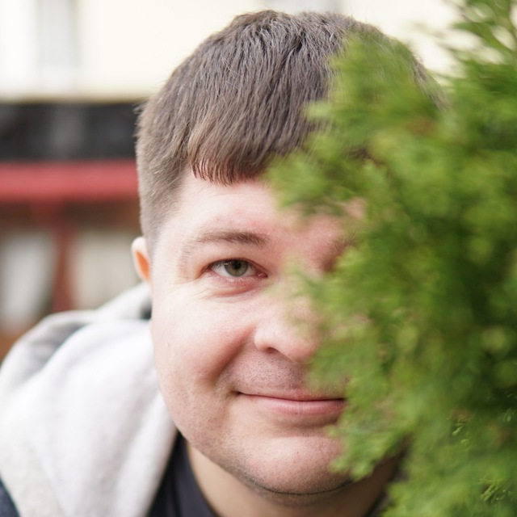

# **Pavlov Dmitry**


## Contacts
- **location :** Kemerovo, Russia
- **github :** https://github.com/nihtsvoron
- **discord :** Dmitry Pavlov (@Nihtsvoron)

## Skills
- **backend :** .NET Developer
- **frontend :** Junior frontend development

## Code
```
public class CustomMath {
    public static int multiply(int a, int b) {
        return a*b;
    }
}
```

## Projects
[rsschool-cv](https://github.com/NihtsVoron/rsschool-cv/)

## Education
Kemerovo State University

## English
A2 English (Pre Intermediate)